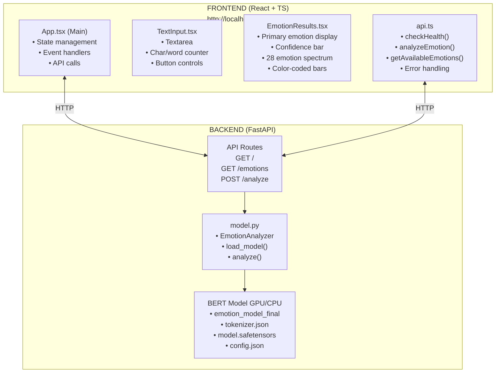
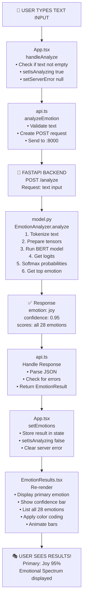
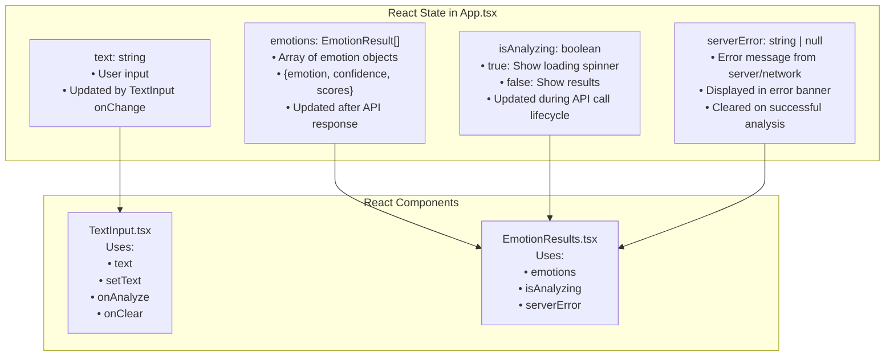
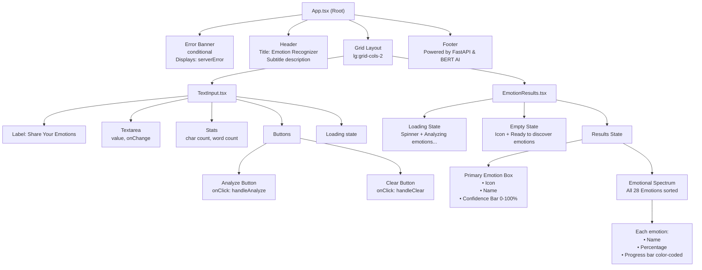
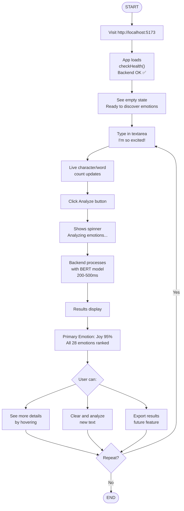
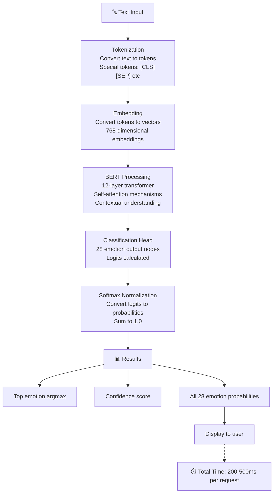
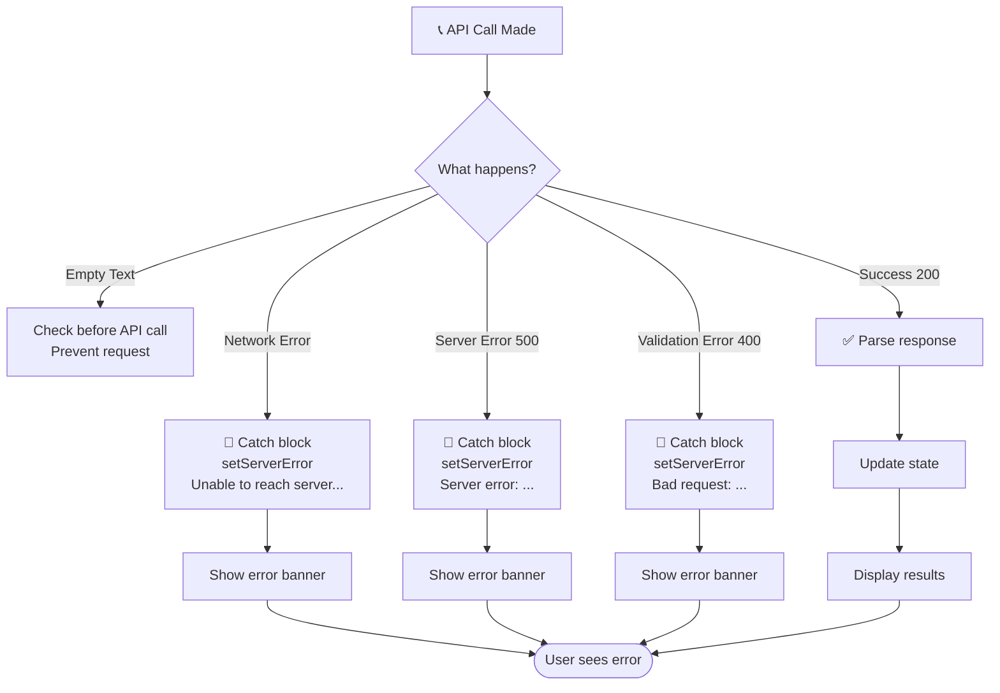

# System Architecture & Data Flow Diagrams

## 🏗️ Overall System Architecture



---

## 📊 Data Flow Diagram



---

## 🔄 State Management Flow



---

## 🎨 Component Hierarchy



---

## 🌐 API Request/Response Format

```
REQUEST:
┌─────────────────────────────────────┐
│  POST /analyze                      │
│  Content-Type: application/json     │
│                                     │
│  {                                  │
│    "text": "I'm so happy!"          │
│  }                                  │
└─────────────────────────────────────┘

RESPONSE (200 OK):
┌──────────────────────────────────────────┐
│  {                                       │
│    "text": "I'm so happy!",              │
│    "emotion": "joy",                     │
│    "confidence": 0.9534,                 │
│    "scores": {                           │
│      "admiration": 0.0012,               │
│      "amusement": 0.0084,                │
│      ...                                 │
│      "joy": 0.9534,                      │
│      ...                                 │
│      "neutral": 0.0024                   │
│    }                                     │
│  }                                       │
└──────────────────────────────────────────┘

ERROR RESPONSE (400/500):
┌──────────────────────────────────────────┐
│  {                                       │
│    "detail": "Error message here"        │
│  }                                       │
└──────────────────────────────────────────┘
```

---

## 🎯 User Journey Map



---

## 🛠️ Technical Stack

```
FRONTEND
├── React 18 (UI Framework)
├── TypeScript (Type Safety)
├── Vite (Build Tool)
├── Tailwind CSS (Styling)
├── Lucide React (Icons)
└── Fetch API (HTTP Requests)

BACKEND  
├── FastAPI (Web Framework)
├── Pydantic (Data Validation)
├── PyTorch (ML Framework)
├── Transformers (BERT Model)
└── Uvicorn (ASGI Server)

COMMUNICATION
├── HTTP REST API
├── JSON Request/Response
├── CORS Enabled
└── No authentication (dev mode)
```

---

## 📈 Processing Pipeline



---

## 🔐 Error Handling Flow



---

All diagrams visualize the complete system architecture! 🎭✨
