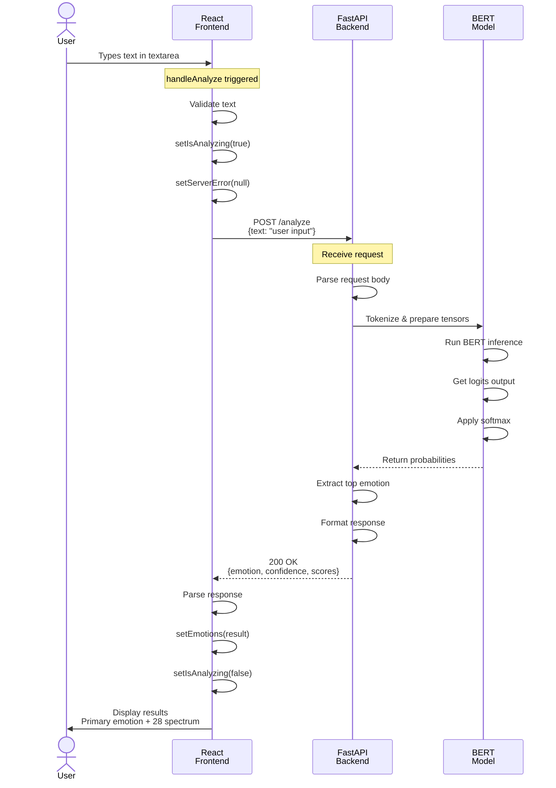
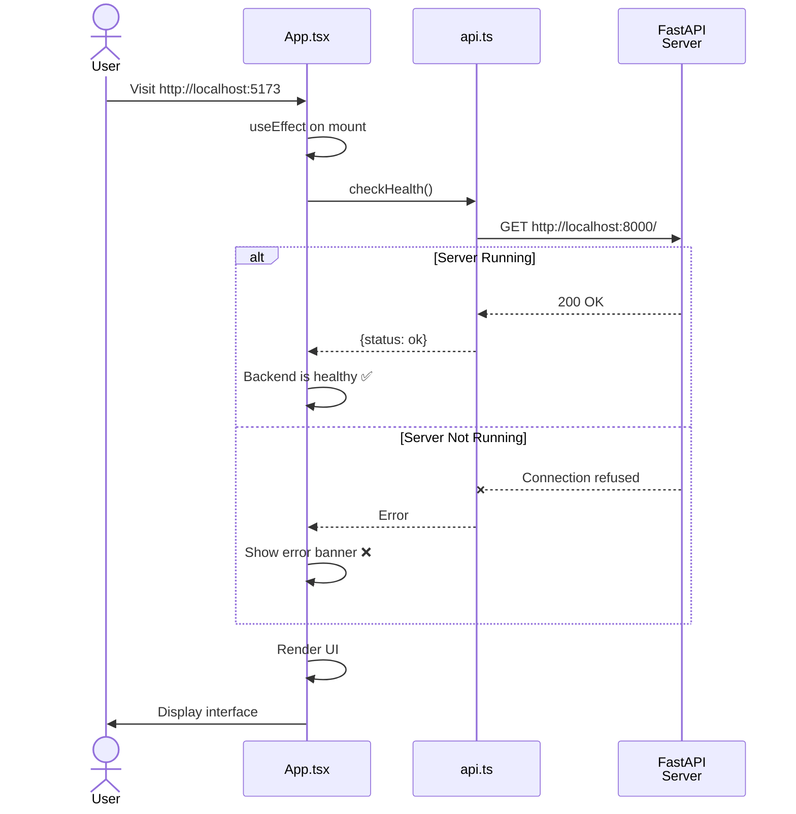
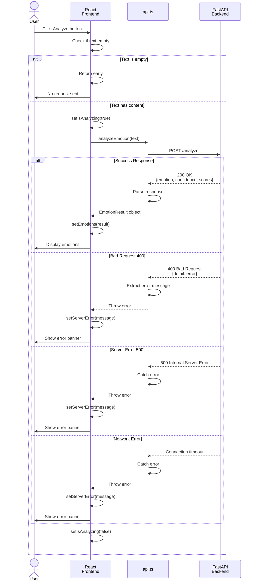
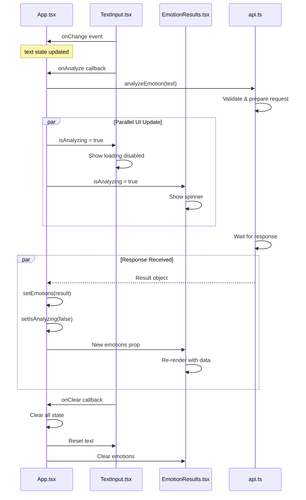
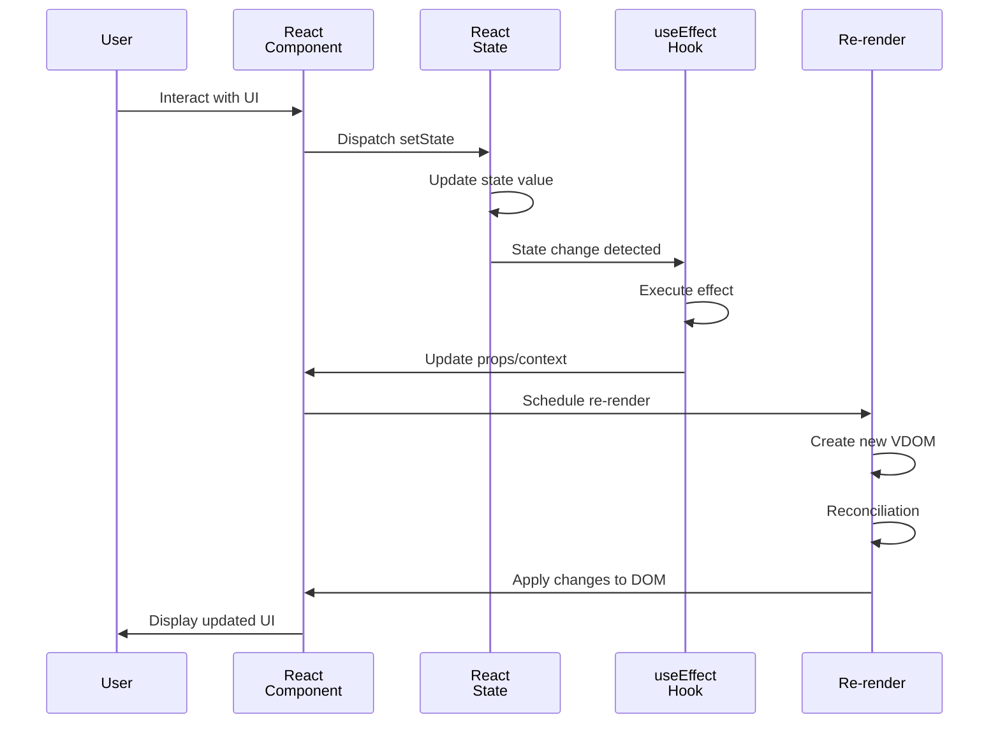

# Sequence Diagrams

## 🔄 Emotion Analysis Flow - Sequence Diagram

---

## 🔍 Health Check - Sequence Diagram

---

## ⚠️ Error Handling - Sequence Diagram

---

## 🎨 Component Interaction - Sequence Diagram

---

## 📊 State Update Cycle - Sequence Diagram

---

All sequence diagrams visualize the complete interaction flows! 🔄✨
