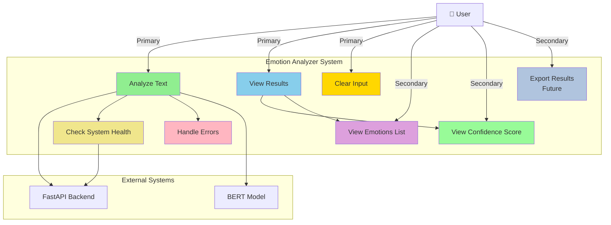
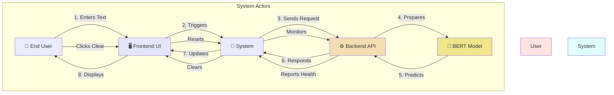
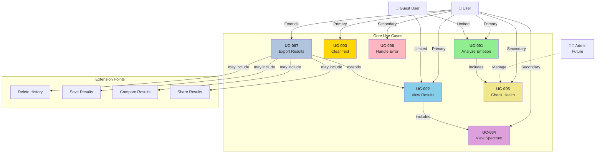
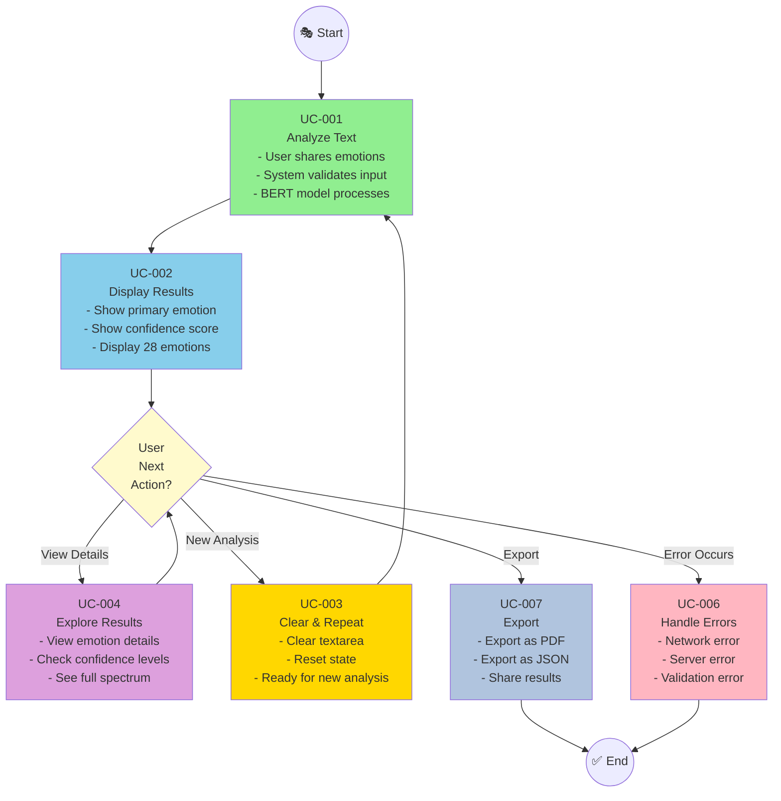
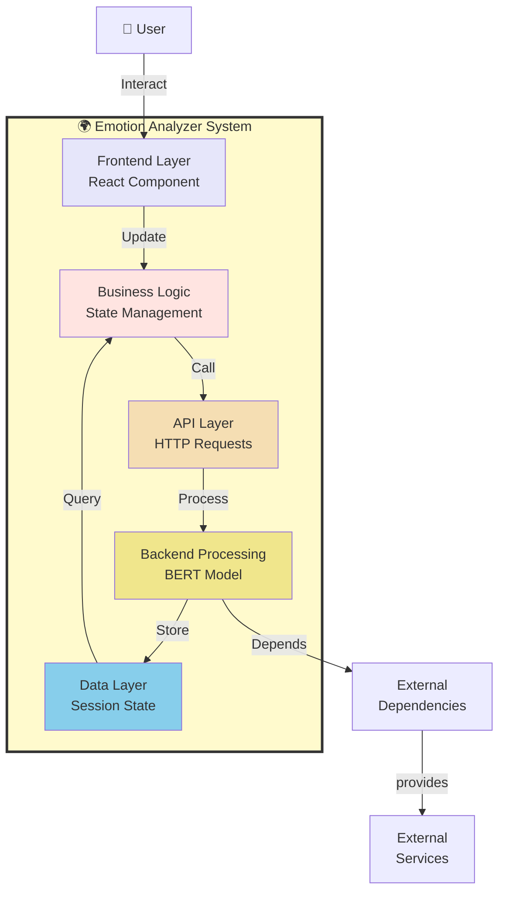
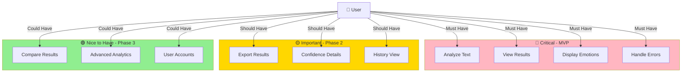

# Use Case Diagrams

## 🎭 Emotion Analyzer - Use Case Diagram

---

## 👥 Actor Interactions - Use Case Diagram

---

## 📋 Detailed Use Cases - Use Case Diagram

---

## 🔄 User Workflow - Use Case Diagram

---

## 🏗️ System Boundary - Use Case Diagram

---

## 📊 Feature Prioritization - Use Case Diagram

---

All use case diagrams visualize different perspectives of the system! 🎭✨
